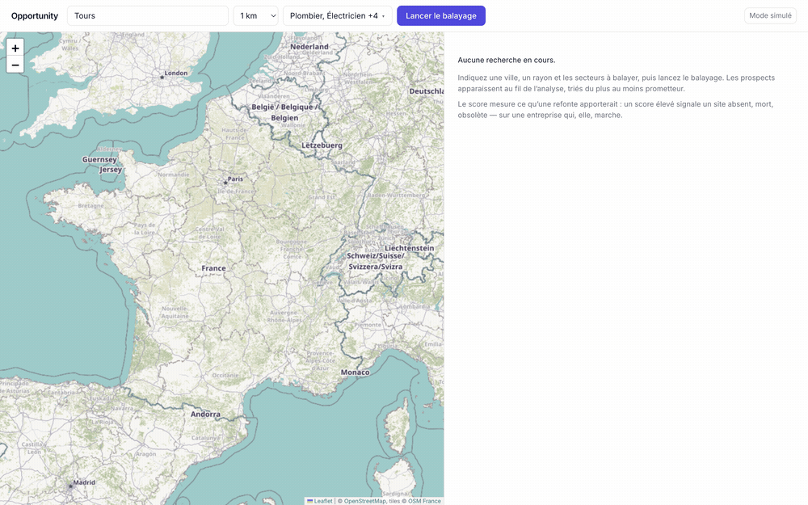
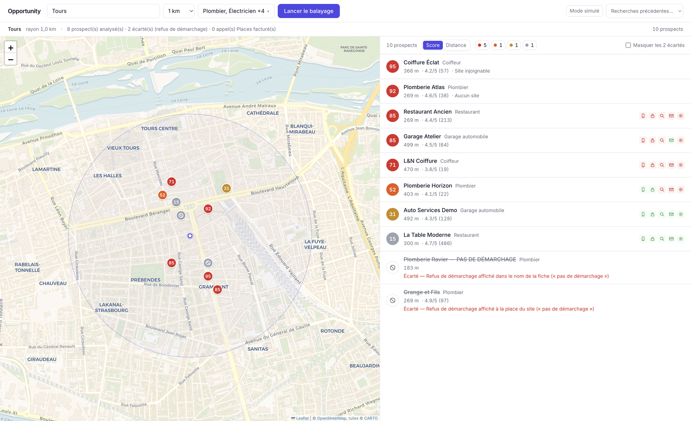
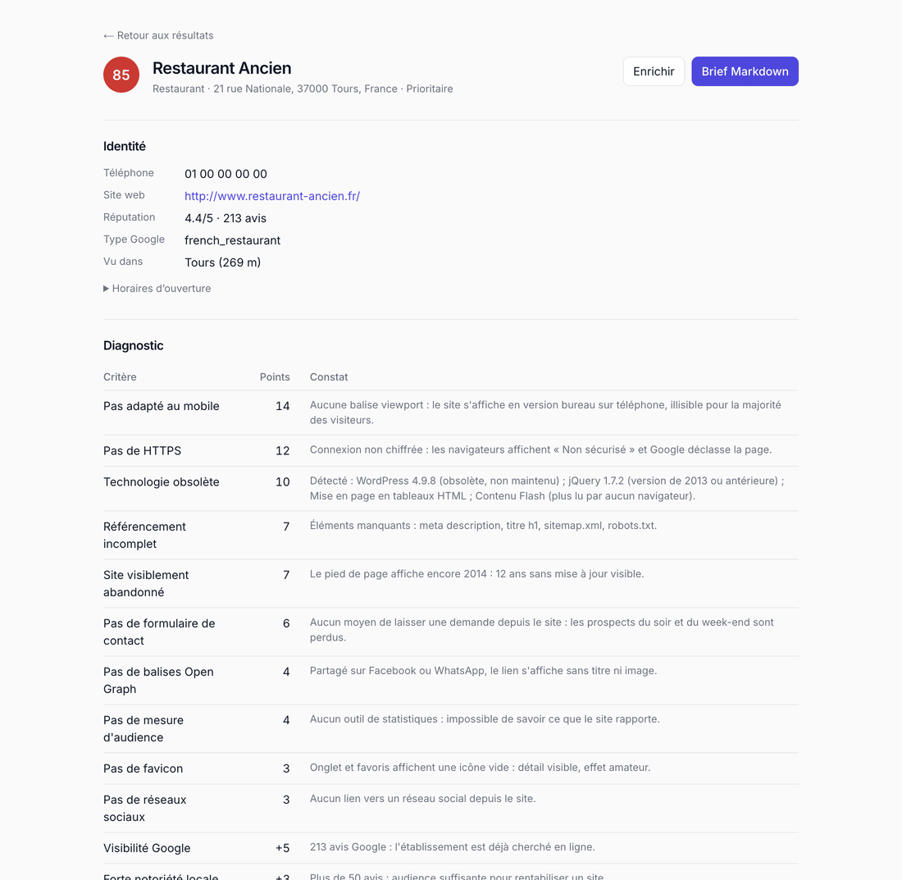

# Opportunity

**Trouvez les entreprises locales dont le site est absent, cassé ou dépassé — et arrivez au rendez-vous avec le brief déjà rédigé.**

[](https://github.com/Fendry02/opportunity/actions/workflows/ci.yml)
[](LICENSE)
[](https://nextjs.org)
[](https://nodejs.org)



## Pourquoi

Quand on vend des refontes de sites, le difficile n'est pas le pitch — c'est de
trouver les vingt entreprises du secteur dont le site justifie vraiment l'appel.
Concrètement : ouvrir des centaines d'onglets, plisser les yeux sur chaque site
depuis un téléphone, et deviner.

Opportunity plisse les yeux à votre place. Il balaie un rayon, confronte la
présence web de chaque entreprise à une liste fixe de défauts, les classe de 0 à
100, et rédige un brief Markdown lisible dans la voiture avant le rendez-vous.

Tout tourne sur votre machine. Pas de compte, pas de backend hébergé, pas de
LLM. Le diagnostic vient d'heuristiques déterministes, de données publiques et
d'un cache SQLite local qui vous appartient.

> [!IMPORTANT]
> **Opportunity est centré sur la France.** Le géocodage passe par l'API BAN de
> l'État (`api-adresse.data.gouv.fr`) et l'enrichissement par
> `recherche-entreprises.api.gouv.fr` — les deux ne couvrent que la France.
> L'interface est en français. Tout le reste (score, analyse de site, Google
> Places) est indépendant du pays : brancher un autre géocodeur est l'essentiel
> du travail pour s'en servir ailleurs. Voir la [feuille de
> route](#feuille-de-route).

## Ce qu'il fait

- Balayer autour d'une ville ou d'une adresse précise, avec un rayon
  configurable.
- Couvrir plusieurs métiers d'un coup : plombiers, électriciens, menuisiers,
  restaurants, coiffeurs, garages — la liste tient dans [un seul fichier
  éditable](config/sectors.ts).
- Noter chaque entreprise sur l'opportunité commerciale : pas de site, site
  mort, pas de viewport mobile, bases SEO faibles, technologie obsolète, pas de
  formulaire de contact, balises Open Graph manquantes, pas de favicon, pages
  lourdes ou lentes.
- Afficher les prospects sur une carte avec des pastilles colorées par score et
  une liste triable synchronisée.
- Ouvrir un prospect sans quitter la carte, inspecter le détail du score, puis
  exporter un brief Markdown prêt pour la prise de contact.
- Mettre en cache géocodage, Places, récupérations de sites et enrichissement
  dans SQLite : une recherche relancée ne consomme jamais deux fois du quota.
- **Respecter les refus de démarchage** du type `pas de démarchage pour un site`
  avant de noter ou de briefer une entreprise.



## Démarrage rapide

```bash
npm install
cp .env.local.example .env.local
npm run dev
```

Ouvrez <http://localhost:3000> et cliquez sur **Lancer le balayage**.

`.env.local.example` positionne `MOCK_EXTERNAL=1`. Dans ce mode, l'application
lit [`fixtures/`](fixtures/) et **ne fait aucun appel sortant côté serveur** —
vous obtenez une démo complète sur Tours, avec dix entreprises fictives, sans
clé Google et sans dépenser un centime. Tout ce qui suit à propos de Google
Places ne compte qu'une fois ce drapeau désactivé.

Seule exception, et elle est côté navigateur : les tuiles du fond de carte sont
chargées depuis CARTO. Elles ne passent pas par `cachedFetch()` et ne sont donc
pas coupées par le mode mock. C'est gratuit et sans clé, mais ce n'est pas hors
ligne.

## Le résultat

Le tout est fait pour produire ce fichier. Un clic sur **Brief Markdown** le
génère pour n'importe quel prospect :

<details>
<summary><b>Exemple de brief — Restaurant Ancien, 85/100</b> (généré depuis les fixtures de démo)</summary>

```markdown
# Restaurant Ancien

**Score d'opportunité : 85/100** — Prioritaire

## Identité

- **Secteur** : Restaurant
- **Adresse** : 21 rue Nationale, 37000 Tours, France
- **Téléphone** : 01 00 00 00 00
- **Site web** : http://www.restaurant-ancien.fr/
- **Réputation Google** : 4.4/5 sur 213 avis

## Interlocuteur

_Non identifié._ Lancer l'enrichissement depuis la fiche, ou appeler en demandant « le responsable » à l'accueil.

## Diagnostic

| Critère | Points | Constat |
| --- | ---: | --- |
| Pas adapté au mobile | 14 | Aucune balise viewport : le site s'affiche en version bureau sur téléphone, illisible pour la majorité des visiteurs. |
| Pas de HTTPS | 12 | Connexion non chiffrée : les navigateurs affichent « Non sécurisé » et Google déclasse la page. |
| Technologie obsolète | 10 | Détecté : WordPress 4.9.8 (obsolète, non maintenu) ; jQuery 1.7.2 (version de 2013 ou antérieure) ; Mise en page en tableaux HTML ; Contenu Flash (plus lu par aucun navigateur). |
| Référencement incomplet | 7 | Éléments manquants : meta description, titre h1, sitemap.xml, robots.txt. |
| Site visiblement abandonné | 7 | Le pied de page affiche encore 2014 : 12 ans sans mise à jour visible. |
| Pas de formulaire de contact | 6 | Aucun moyen de laisser une demande depuis le site : les prospects du soir et du week-end sont perdus. |
| Pas de balises Open Graph | 4 | Partagé sur Facebook ou WhatsApp, le lien s'affiche sans titre ni image. |
| Pas de mesure d'audience | 4 | Aucun outil de statistiques : impossible de savoir ce que le site rapporte. |
| Pas de favicon | 3 | Onglet et favoris affichent une icône vide : détail visible, effet amateur. |
| Pas de réseaux sociaux | 3 | Aucun lien vers un réseau social depuis le site. |
| Visibilité Google | +5 | 213 avis Google : l'établissement est déjà cherché en ligne. |
| Forte notoriété locale | +3 | Plus de 50 avis : audience suffisante pour rentabiliser un site. |
| Bonne réputation | +4 | Note de 4.4/5 : la qualité est là, la vitrine ne suit pas. |
| Joignable directement | +3 | Téléphone public : prise de contact immédiate possible. |

**Total : 85/100**

## Recommandations

1. Refonte responsive en priorité absolue : sur ce type d'activité, la majorité des visites viennent du mobile. Montrer le site sur son propre téléphone pendant le rendez-vous.
2. Installer un certificat TLS (gratuit via Let's Encrypt) et forcer la redirection. Faire constater l'avertissement « Non sécurisé » du navigateur.
3. Reconstruire sur une base maintenue. Insister sur le risque : un CMS non mis à jour est la première porte d'entrée des piratages de sites vitrines.
4. Reprendre les balises de base (title, meta description, h1) et publier sitemap.xml + robots.txt.
5. Le site donne l'impression d'une entreprise à l'arrêt. Argument fort auprès d'un dirigeant qui, lui, sait que son activité tourne.

### Angle d'attaque

- L'établissement est déjà cherché en ligne : la demande existe, seule la vitrine manque.
- Audience suffisante pour rentabiliser rapidement une refonte.
- La qualité perçue est excellente — le site ne lui rend pas justice.
```

</details>

Chaque défaut porte son propre argument commercial, parce que le chiffre seul ne
survit pas au contact d'un dirigeant.

<p align="center">
  
</p>

## Comment le score est calculé

Une entreprise sans site, ou dont le site est injoignable, démarre haut — c'est
la conversation de refonte la plus probable. Un site existant est noté à partir
de ses défauts visibles et de signaux commerciaux.

Principaux défauts : pas de HTTPS ; pas de viewport mobile ; title, meta
description, H1, sitemap ou robots manquants ; technologie obsolète ou
constructeurs gratuits (pages Facebook, Wix, e-monsite) ; pas de formulaire de
contact ; pas de balises Open Graph ni de favicon ; année de copyright figée ;
pages lourdes ou lentes.

Les bonus d'attractivité tiennent compte de la réputation, du volume d'avis et
de la disponibilité d'un téléphone — une entreprise que personne ne cherche est
un moins bon prospect qu'une entreprise très demandée avec un mauvais site.

Tous les poids vivent dans [`lib/scoring.ts`](lib/scoring.ts). Les défauts sont
plafonnés collectivement (`MAX_DEFECTS`) pour qu'aucun signal isolé ne domine un
score.

## Ce que ça coûte à l'usage

Rien en mode mock. Avec `MOCK_EXTERNAL=0`, Opportunity sollicite deux SKU Google
facturés, déterminés par ses masques de champs figés dans
[`lib/places/client.ts`](lib/places/client.ts) :

| Appel | SKU | Prix (0–100k/mois) | Gratuit chaque mois |
| --- | --- | ---: | ---: |
| Recherche par secteur | Text Search **Pro** | 32,00 $ / 1 000 | 5 000 |
| Détail d'un prospect | Place Details **Enterprise** | 20,00 $ / 1 000 | 1 000 |

Les détails tombent en Enterprise parce que le masque demande `rating`,
`userRatingCount` et `regularOpeningHours` — les signaux dont le score a besoin.
La recherche reste délibérément en Pro : aucun champ Enterprise n'est jamais
autorisé dans le masque de recherche.

**Un balayage qui retient 100 prospects coûte environ 2,50 $** — une centaine
d'appels Details plus une douzaine d'appels Text Search. L'enveloppe gratuite
mensuelle couvre environ **1 000 prospects avant la moindre facturation**.

Trois garde-fous maintiennent ce niveau :

- des valeurs `X-Goog-FieldMask` strictes — les modifier modifie votre facture ;
- un plafond quotidien local via `PLACES_DAILY_CAP` (300 par défaut) ;
- le cache SQLite, qui rend gratuite une recherche relancée.

Les prix sont les tarifs publics de Google en dollars, vérifiés le 7 août 2026
sur la [page de tarification Google Maps
Platform](https://developers.google.com/maps/billing-and-pricing/pricing) ; les
comptes européens sont facturés en euros au taux de Google. Vérifiez avant de
vous y fier.

## Éthique

Opportunity regarde des **entreprises, pas des personnes**, et uniquement ce que
ces entreprises publient elles-mêmes. Aucune donnée personnelle dans le
pipeline, aucune collecte d'e-mails, aucun scraping au-delà de pages publiques
qu'un navigateur récupérerait de toute façon.

Deux règles sont structurantes :

- **Le refus de démarchage est respecté.** Une fiche qui signale ne pas vouloir
  être démarchée à propos d'un site — dans son nom ou sur son site — est exclue
  du score et de la génération de brief ([`lib/opt-out.ts`](lib/opt-out.ts)).
  C'est visible dans la démo : deux des douze entreprises sont barrées.
- **Un brief est fait pour être lu par un humain.** La sortie est un document
  que vous relisez avant de décider de contacter quelqu'un. En faire une machine
  à e-mailing automatique est un [hors périmètre](#hors-périmètre) explicite.

## Configuration Google Places

Nécessaire uniquement pour passer à `MOCK_EXTERNAL=0`.

1. Créez un projet Google Cloud et rattachez-y une facturation.
2. Activez **Places API (New)**. N'activez *pas* l'ancienne Places API.
3. Créez une clé d'API restreinte à **Places API (New)**.
4. Ajoutez-la dans `.env.local` :

```bash
GOOGLE_PLACES_API_KEY=votre_cle_google_places
MOCK_EXTERNAL=0
PLACES_DAILY_CAP=300
```

Validez la clé avec un seul appel avant de lancer un vrai balayage :

```bash
npm run places:smoke -- "plombier à Tours"
```

## Le fond de carte

Données OpenStreetMap, rendues par [CARTO
Voyager](https://carto.com/basemaps) — gratuit, sans compte, sans clé d'API.
Aucune configuration.

Le fond est volontairement en palette sourde : les pastilles de score sont
rouges et orangées, et un fond coloré entre en concurrence chromatique avec
elles dès qu'un balayage est dense. Voyager conserve malgré tout des routes
contrastées, ce qui permet de suivre une rue sous un amas de pins — c'est ce
qui l'a fait préférer à Positron, plus épuré mais trop délavé pour ça.

Un fond vectoriel donnerait un contrôle complet du style et un zoom continu.
Le travail est commencé sur la branche `carte/fond-vectoriel` mais **ne rend
pas** : MapLibre s'initialise sans erreur puis ne demande jamais ses tuiles. Le
diagnostic est consigné dans le message de commit de cette branche.

## Scripts

| Commande | Rôle |
| --- | --- |
| `npm run dev` | Démarrer l'application en local |
| `npm run build` | Construire pour la production |
| `npm start` | Démarrer le build de production |
| `npm test` | Tests unitaires, sans accès réseau |
| `npm run typecheck` | Vérifications TypeScript |
| `npm run lint` | ESLint |
| `npm run db:check` | Vérifier le schéma SQLite, le WAL, le cache et les TTL |
| `npm run places:smoke` | Un vrai appel Places search + details |

La base vit dans `data/opportunity.db` et est ignorée par git. Supprimez-la pour
remettre à zéro recherches, réponses en cache et compteurs journaliers.
Définissez `OPPORTUNITY_DB_PATH` pour la placer ailleurs.

## Architecture

```text
app/            routes Next.js et handlers d'API
components/     UI : recherche, carte, liste, barre d'outils, fiches prospect
config/         secteurs éditables et réglages de recherche par défaut
fixtures/       données simulées pour les démos et les tests
lib/            logique métier, cache, analyseurs, score, enrichissement
scripts/        vérifications smoke et validation de la base
tests/          couverture node:test du score, de l'analyseur, de la mémoire, des filtres
```

Les frontières qui gardent le projet peu coûteux et testable :

- `lib/` n'importe jamais React.
- Les routes d'API valident leur entrée et délèguent à `lib/`.
- Les composants ne parlent qu'aux routes d'API locales.
- `cachedFetch()` dans [`lib/cache.ts`](lib/cache.ts) est le **seul** endroit qui
  effectue une requête externe — c'est ce qui fait de `MOCK_EXTERNAL=1` un mode
  hors-ligne complet.

## Sources de données

| Source | Rôle | TTL du cache |
| --- | --- | --- |
| `api-adresse.data.gouv.fr` | Géocodage français (BAN) | 365 jours |
| Google Places Text Search | Entreprises locales par secteur | 7 jours |
| Google Places Details | Site web, téléphone, note, horaires | 30 jours |
| Sites des prospects | Signaux techniques et de contenu | 7 jours |
| `recherche-entreprises.api.gouv.fr` | Enrichissement entreprise (SIREN, dirigeants) | 90 jours |
| `basemaps.cartocdn.com` | Tuiles du fond de carte | — (chargé par le navigateur) |

## Feuille de route

Pas des promesses — les directions qui amélioreraient le plus l'outil, dans un
ordre approximatif :

- **Un géocodeur enfichable**, pour que l'application fonctionne hors de France.
  C'est de loin la plus grosse limite aujourd'hui.
- Plus de signaux de score. C'est la façon la plus simple de contribuer — voir
  le [gabarit d'issue dédié](.github/ISSUE_TEMPLATE/new_signal.yml).
- Exporter un balayage entier d'un coup, plutôt qu'un brief à la fois.
- Suivre l'état de la prise de contact par prospect, d'un balayage à l'autre.

### Hors périmètre

Énoncé pour que personne ne gaspille une pull request dessus :

- **Pas de SaaS, pas de version hébergée, pas de comptes.** Ça tourne sur votre
  machine, sur vos données, avec votre clé d'API.
- **Pas de LLM.** Le diagnostic est déterministe et reproductible : le même site
  obtient deux fois le même score.
- **Pas de CRM.** L'outil trouve des prospects ; il n'est pas là où vous les
  gérez.
- **Pas de prospection automatisée.** Ni e-mailing de masse, ni appels
  automatiques, ni séquences.
- **Pas de scraping au-delà des pages publiques.** Pas d'authentification, pas
  de contenu payant, pas de données personnelles.

## Vérification

```bash
npm run lint
npm run typecheck
npm test
npm run db:check
```

Le CI exécute ces quatre commandes plus `npm run build` sur chaque pull request.
`npm run places:smoke` en est volontairement exclu : il exige une vraie clé et
consomme du quota.

## Contribuer

Rapports de bugs, signaux de score et pull requests sont les bienvenus — voir
[CONTRIBUTING.md](CONTRIBUTING.md) pour l'installation, les invariants
d'architecture qu'un relecteur vérifiera, et les recettes pour ajouter un
secteur ou un signal de score.

## Licence

[GNU AGPL-3.0](LICENSE). Vous pouvez l'utiliser, le modifier et le redistribuer
librement ; si vous exécutez une version modifiée comme service en réseau, vous
devez publier vos modifications.
