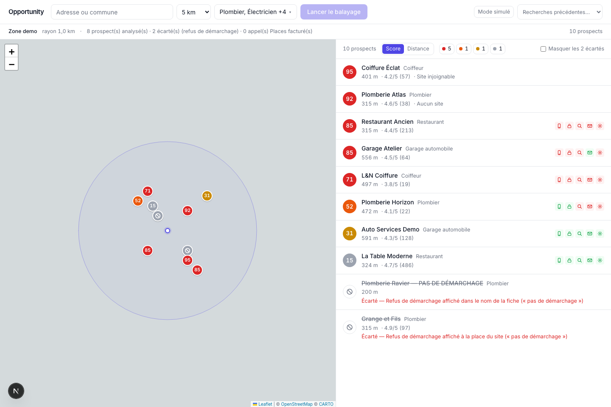
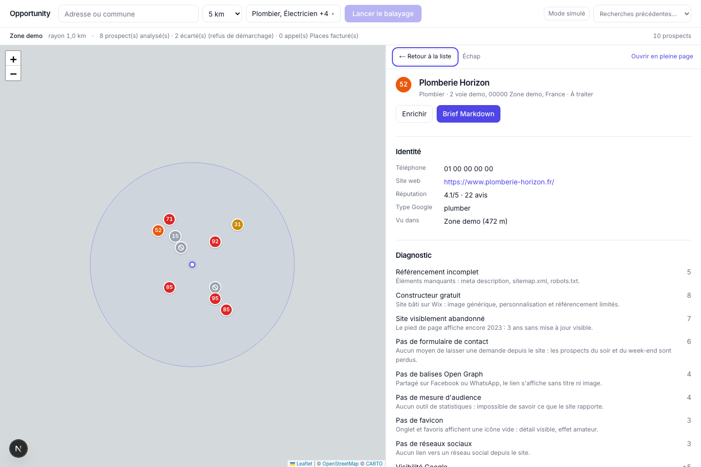

# Opportunity

Opportunity is a local-first prospecting workspace for people selling website
redesigns to nearby businesses. It scans a city or address, finds businesses
whose web presence looks absent, broken, outdated, or hard to convert, ranks
them from 0 to 100, and generates a Markdown sales brief for each prospect.

The product is deliberately pragmatic: no authentication, no SaaS backend, no
LLM dependency. The diagnosis comes from deterministic heuristics, public data,
and a local SQLite cache you control.





## What It Does

- Search around a city or a precise address with a configurable radius.
- Sweep multiple local sectors at once: plumbers, hair salons, restaurants,
  garages, electricians, carpenters, and more.
- Score each business by commercial opportunity: no website, dead website,
  missing mobile viewport, weak SEO basics, old tech, no contact form, missing
  Open Graph tags, no favicon, slow or heavy pages.
- Display prospects on a Leaflet map, with score-colored pins and a synchronized
  sortable list.
- Open a prospect panel without leaving the map, inspect the score breakdown,
  then export a Markdown brief ready for sales outreach.
- Cache geocoding, Google Places, website fetches, and enrichment calls in
  SQLite so repeated searches do not spend quota again.
- Respect opt-out signals such as "pas de demarchage pour un site" before
  scoring or briefing a business.

## Quick Start

```bash
npm install
cp .env.local.example .env.local
npm run dev
```

Open <http://localhost:3000>.

By default, `.env.local.example` uses `MOCK_EXTERNAL=1`. In this mode the app
reads from `fixtures/` and makes no external network calls, so you can demo and
test the product without a Google Places key. Search for `Zone demo` to use the
fixture dataset.

## Scripts

| Command | Purpose |
| --- | --- |
| `npm run dev` | Start the local Next.js app |
| `npm run build` | Build for production |
| `npm start` | Start the production build |
| `npm test` | Run unit tests without network access |
| `npm run typecheck` | Run TypeScript checks |
| `npm run lint` | Run ESLint |
| `npm run db:check` | Verify SQLite schema, WAL, cache, and TTL behavior |
| `npm run places:smoke` | Make one real Places search + details call |

The local database lives in `data/opportunity.db` and is ignored by Git. Delete
it to reset searches, cached responses, and daily usage counters.

## Google Places Setup

You only need Google Places when switching `MOCK_EXTERNAL=0`.

1. Create a Google Cloud project and attach billing.
2. Enable **Places API (New)**. Do not enable the legacy Places API for this app.
3. Create an API key restricted to **Places API (New)**.
4. Add it to `.env.local`:

```bash
GOOGLE_PLACES_API_KEY=your_google_places_key
MOCK_EXTERNAL=0
PLACES_DAILY_CAP=300
```

Places billing depends on the fields requested. Opportunity keeps Text Search
and Place Details separate so search calls stay on the cheaper Pro SKU, while
website and phone details are fetched only for retained prospects.

The app has three cost guardrails:

- strict `X-Goog-FieldMask` values in `lib/places/client.ts`;
- a local daily cap through `PLACES_DAILY_CAP`;
- SQLite caching for repeated geocoding, Places, website, and enrichment calls.

Before running a real sweep, validate the key with one small call:

```bash
npm run places:smoke -- "plombier à Zone demo"
```

## How Scoring Works

Businesses without a website, or with an unreachable website, start high because
they are likely candidates for a redesign conversation. Existing websites are
scored from visible defects and commercial signals.

Main defects include:

- no HTTPS;
- missing mobile viewport;
- missing title, meta description, H1, sitemap, or robots file;
- old or generic builders such as Facebook pages and free site builders;
- missing contact form;
- missing Open Graph tags or favicon;
- outdated copyright year;
- heavy or slow pages.

Attractiveness bonuses consider reputation, review volume, and phone
availability. The scoring table is centralized in `lib/scoring.ts`.

## Architecture

```text
app/                Next.js routes and API handlers
components/         UI for search, map, list, toolbar, and prospect panels
config/             editable sectors and default search settings
fixtures/           mock data for demos and tests
lib/                business logic, cache, analyzers, scoring, enrichment
scripts/            smoke checks and database validation
tests/              node:test coverage for scoring, analyzer, memory, filters
```

Important boundaries:

- `lib/` does not import React.
- API routes validate inputs and call `lib/`.
- Components only talk to local API routes.
- `cachedFetch()` in `lib/cache.ts` is the only place that performs external
  fetches.

## Data Sources

| Source | Purpose | Cache TTL |
| --- | --- | --- |
| `api-adresse.data.gouv.fr` | French geocoding | 365 days |
| Google Places Text Search | Local businesses by sector | 7 days |
| Google Places Details | Website, phone, rating, opening hours | 30 days |
| Prospect websites | Technical and content signals | 7 days |
| `recherche-entreprises.api.gouv.fr` | Business enrichment | 90 days |

## Verification

Current checks:

- `npm test`
- `npm run typecheck`
- `npm run lint`
- `npm run db:check`

The Places smoke test is intentionally separate because it needs a real Google
API key and can consume quota.
